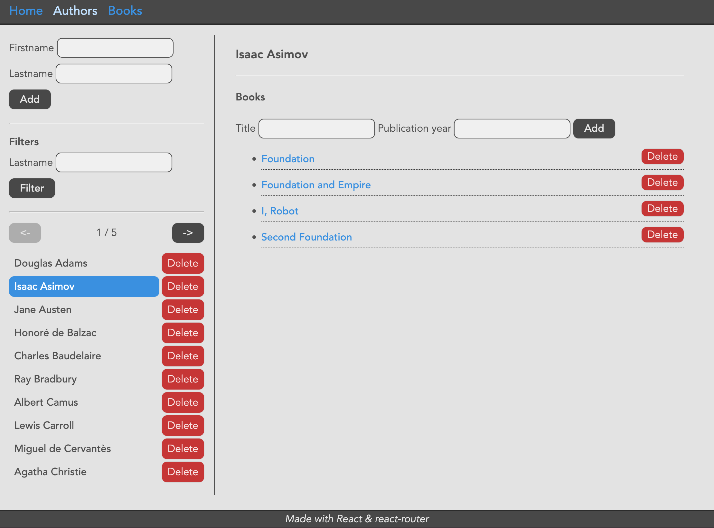
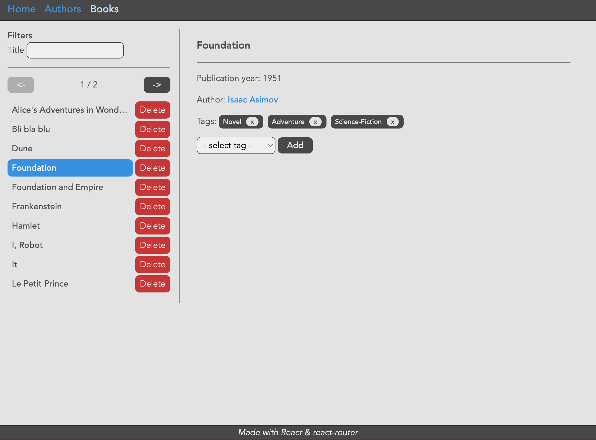
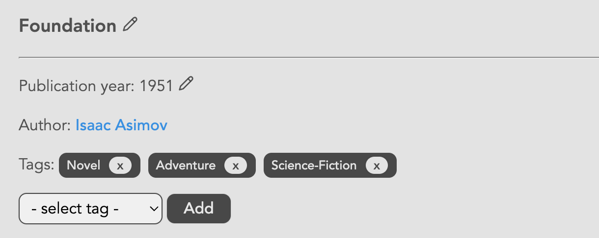

# Interface pour l'API de gestion de livres

Mise en place
---

Initialiser un nouveau dossier `tp5` avec `vite`.
Puis :
- Écraser le contenu du fichier `src/index.css` par le contenu du fichier du même nom situé dans le dossier `ressources`.
- Supprimer le fichier `src/App.css`.
- Supprimer le fichier `src/App.tsx`.

Installer le paquet `react-router` :
```
npm install react-router
```

- Récupérer les fichiers `src/routes/root.tsx` et `src/main.tsx` du TP précédent puis y supprimer tout ce qui concerne les routes `"items"` et `"grocery"`.

On va développer une interface pour l'API de de gestion de livres que l'on a développée en w41.

- Lancer l'API (la version sans la gestion des `User` sera suffisante).

> __Des modifications pourront être apportées à l'API au fur et à mesure des éventuels besoins de l'application client.__

Cross-Origin Resource Sharing
---

Notre application client a été servie au navigateur par un serveur hébergé par un domaine donné (par exemple `http://localhost:5173` quand c'est via le serveur de développement).

L'API à qui on veut faire des requêtes est elle accessible à un domaine différent de celui qui nous a servi l'application client (par exemple `http://localhost:3000`).

Le navigateur ne s'autorise pas à faire des requêtes à un autre domaine sans avoir au préalable vérifié auprès de lui que ce dernier accepte les requêtes en provenance d'une application obtenue depuis un autre domaine (https://developer.mozilla.org/en-US/docs/Web/HTTP/CORS).

En pratique, le navigateur fera une "_preflight request_" au serveur cible (https://developer.mozilla.org/en-US/docs/Glossary/Preflight_request) afin d'obtenir de sa part une description des autorisations données par ce serveur et ainsi savoir si la requête qu'il souhaite effectuer peut être envoyée.

Il faut donc que le serveur soit configuré de manière à répondre correctement à ces requêtes de vérification ("_preflight requests_").

Dans le cadre d'une application `express`, on peut très simplement utiliser le middleware `cors` (https://www.npmjs.com/package/cors), avec ses options par défaut, pour gérer cela.

Au sein du projet de votre API :

```sh
npm install cors
npm install -D @types/cors
```

Puis dans le fichier principal de votre application, ajouter les lignes suivantes :

```js
// ...
import cors from 'cors';
// ...
app.use(cors()); // premier middleware
```

Dans ce cas simple (configuration par défaut), le serveur annonce qu'il accepte toutes les requêtes en provenance de n'importe quelle origine. On pourrait restreindre les origines autorisées en précisant plus de choses dans un objet de configuration passé à la fonction `cors()`.

Afin que le code client puisse accéder en lecture au contenu de l'en-tête `X-Total-Count` fourni par l'API dans certaines réponses, il faut également ajouter dans la foulée un middleware qui expose cet en-tête (sinon l'en-tête arrive bien au client, mais le navigateur ne permet pas à notre code d'y accéder) :
```js
app.use((req: Request, res: Response, next: NextFunction) => {
  res.header('Access-Control-Expose-Headers', 'X-Total-Count');
  next();
});
```

Types
---

On développe ici notre application client de manière complètement indépendante de l'API. On pourrait même très bien ne pas savoir dans quel langage de programmation cette API a été développée. On va donc commencer par définir les types des objets que l'on va manipuler.

Dans un nouveau module `src/types.ts`, définir et exporter les types suivants : `Author`, `AuthorCreationData`, `Book`, `BookCreationData`, `Tag`.

Dans ces types, les tableaux d'entités associées (par exemple les `tags` d'un `Book`) seront déclarés optionnels.

Fonctions d'appel à l'API
---

Afin de mieux séparer le code ayant connaissance de l'API (chemins, etc.) et le code des composants de l'interface, créer un nouveau module `src/api.ts` qui va exporter des fonctions permettant de faire des requêtes HTTP à l'API.

La fonction standard `fetch` permet de déclencher une requête HTTP : https://developer.mozilla.org/en-US/docs/Web/API/Fetch_API/Using_Fetch.
Elle retourne une `Promise` qui sera résolue avec un objet `Response` une fois que le serveur aura répondu (quel que soit le statut HTTP de la réponse). Le tout premier exemple de la documentation correspond bien à ce que l'on souhaite faire :
- déclencher une requête HTTP GET vers une URL donnée.
- quand la réponse arrive, considérer le corps de la réponse comme du texte au format JSON et le parser.
- quand le texte est parsé, faire quelque chose avec l'objet obtenu.

Par exemple, pour récupérer la liste des auteurs, on peut écrire la fonction suivante :
```ts
export async function get_authors() {
  const res = await fetch(`${apiBasename}/authors`);
  if (!res.ok) {
    const msg = await res.text();
    throw new Error(msg);
  }
  const authors: Author[] = await res.json();
  return authors;
}
```

La valeur de la variable `apiBasename` utilisée ici pourra être définie au début du module.
Sa valeur pourra par exemple être l'adresse `http://localhost:3000`.
Si l'API est accessible à une autre adresse, cette variable sera le seul endroit où il sera nécessaire de modifier cette information.

Comme indiqué, la `Promise` retournée par `fetch` est résolue à partir du moment où l'on obtient une réponse de la part du serveur. Si l'on souhaite déclencher une exception en cas de statut HTTP autre que 200, on peut vérifier la valeur de la propriété `ok` de l'objet `Response`. Cette dernière vaut `true` uniquement si le statut est dans la plage 200-299. Si ce n'est pas le cas, on récupère le texte de la réponse avec la méthode `text()` et on `throw` une nouvelle `Error` construite avec ce texte.

> __On ajoutera des fonctions dans ce module au fur et à mesure des besoins.__

Nouvelles routes
---

- Dans le dossier `src/routes`, créer deux nouveaux modules `authors.tsx` et `books.tsx` qui exportent respectivement un composant `Authors` et `Books` (ces composants peuvent se contenter de rendre un titre par exemple dans un premier temps).
- Importer ces composants dans le module `main.tsx` et déclarer des routes `"authors"` et `"books"` en tant que routes filles de la route `"/"` et leur associer l'élément correspondant.
- Ajouter des liens dans le composant `Root` pour accéder à ces nouvelles routes.

Récupérer la liste des auteurs
---

Le composant `Authors` est chargé de récupérer la liste des auteurs auprès de l'API et de l'afficher. Pour ce faire, ce composant va combiner une entrée de `state` (de valeur initiale `[]`) afin de stocker le tableau d'auteurs, et un `effect` à déclenchement unique afin de faire une requête HTTP à l'API puis de stocker les données reçues dans le state.

Le fonction que l'on fournit à `useEffect` ne peut pas être `async`. On ne peut donc pas `await` un appel à notre fonction `get_authors` directement dans cette fonction. Une solution simple consiste à déclarer une autre fonction `async` dans le composant, nommée `loadAuthors` par exemple. Cette fonction attend le retour de `get_authors` et stocke le résultat dans le `state`. On appellera simplement cette fonction dans l'`effect` pour déclencher la requête à l'API.

Affichage de la liste des auteurs
---

Pour l'affichage, on va organiser notre interface en 2 parties :
- un bandeau à gauche dans lequel s'affichera la liste des auteurs.
- une zone à droite dans laquelle on affichera les informations d'un auteur en particulier.

Le fichier CSS fourni dispose déjà de ce qu'il faut pour arriver à ce résultat. Il faut pour cela que le composant `Authors` retourne la structure suivante :
```js
<>
  <div id="sidebar">
    <ul>
      <li>...</li>
      ... // liste des auteurs
    </ul>
  </div>
  <div id="info">
    <Outlet />
  </div>
</>
```

> L'élément `<> ... </>` est un _fragment_ qui permet de retourner plusieurs éléments _frères_ sans avoir à les encapsuler dans un élément parent supplémentaire qui se retrouverait dans le DOM.

Ajout/Suppression d'un auteur
---

Afin de pouvoir ajouter et supprimer des auteurs, commencer par écrire _dans le composant_ `Authors`, les fonctions `async` suivantes :
- `addAuthor` : reçoit un objet de type `AuthorCreationData`. Appelle et attend le retour d'une fonction `add_author` fournie par le module `src/api.ts`, puis relance la fonction `loadAuthors` pour rafraîchir la liste des auteurs.
- `removeAuthor` : reçoit l'identifiant de la personne à supprimer. Appelle et attend le retour d'une fonction `remove_author` fournie par le module `src/api.ts`, puis relance la fonction `loadAuthors` pour rafraîchir la liste des auteurs.

Les fonctions `add_author` et `remove_author` sont donc à ajouter dans le module `src/api.ts`.

Afin de voir comment effectuer une requête `POST` ou `DELETE` et comment définir des en-têtes et attacher des données au format JSON, vous pouvez à nouveau vous référer à la documentation : https://developer.mozilla.org/en-US/docs/Web/API/Fetch_API/Using_Fetch.

> Les fonctions `loadAuthors`, `addAuthor` et `removeAuthor` que l'on a écrit jusqu'à présent sont des fonctions qui permettent de gérer les données du `state` du composant `Authors` sans rapport direct avec l'interface. Elles seront utilisées ensuite dans des fonctions de gestion d'événement liées à des éléments de l'interface.

Pour exploiter la fonction d'ajout :
- Ajouter un formulaire dans la sidebar au-dessus de la liste. Ce formulaire dispose de deux `<input>` ayant les valeurs `firstname` et `lastname` pour la propriété `"name"`, ainsi que d'un `<button>`.
- Lors de la soumission de ce formulaire (`onSubmit`), appeler une fonction de gestion de l'événement (nommée `handleAdd` par exemple) qui : annule le comportement par défaut du navigateur, puis appelle et attend le retour de la fonction `addAuthor` avec un objet de type `AuthorCreationData` contenant les valeurs issues du formulaire, et enfin réinitialise le formulaire.

Pour exploiter la fonction de suppression :
- Dans la liste d'auteurs, ajouter un `<button>` pour chaque entrée en plus du nom de l'auteur.
- Associer les classes CSS `"small"` et `"danger"` à ces boutons.
- Au clic sur un bouton (`onClick`), appeler une fonction de gestion de l'événement (nommée `handleRemove` par exemple) qui appelle la fonction `removeAuthor` en lui passant l'identifiant de l'auteur.

Gestion des erreurs
---

Dans les fonctions implémentées dans le module `src/api.ts`, on a fait en sorte de lancer une `Error` si le statut de la réponse n'était pas `ok`. On peut donc récupérer ces erreurs dans le composant `Authors` afin de les afficher à l'utilisateur.

Pour ce faire, on commence par ajouter une entrée de `state` de type `string` qui stockera le message d'erreur (ayant pour valeur initiale une chaîne vide). On va également ajouter dans l'interface du composant (sous le formulaire) un élément `<p>` qui affichera ce message si le `state` correspondant contient une chaîne non vide.

Enfin, dans les fonctions de gestion des événements liées au formulaire d'ajout (`handleAdd`) et aux boutons de suppression (`handleRemove`), on va entourer les appels aux fonctions `addAuthor` et `removeAuthor` d'un bloc `try`/`catch`. Si une erreur est attrapée, on stocke le message d'erreur dans le `state`. En cas de succès, on remet ce `state` à une chaîne vide.

Sous-routes
---

Vous pouvez constater la présence d'un élément `<Outlet>` dans la structure de l'interface proposée. Cela sous-entend que l'on a prévu de gérer des sous-routes filles de la route qui affiche cet élément.

- Déclarer deux routes en tant que sous-routes filles de la route `"/authors"`.
- La première route est un `index` qui va simplement afficher un paragraphe de texte indiquant de sélectionner un auteur dans la liste.
- Le chemin de la seconde route est un segment dynamique `":author_id"`.
- Dans le dossier `src/routes`, créer un nouveau module `author.tsx` qui exporte un composant `Author` (qui peut se contenter de rendre un titre par exemple dans un premier temps).
- Importer ce composant dans le module `main.tsx` et l'associer à la nouvelle route.

L'objectif de ce segment dynamique de route est d'avoir une route propre à chaque auteur qui permette d'en afficher et d'en manipuler les détails. Il nous faut maintenant dans un premier temps un moyen de naviguer à destination de ces routes.

- Dans la liste des auteurs, utiliser un élément `<NavLink>` pour chaque auteur. La destination relative de ces liens est simplement l'identifiant de chaque auteur affiché.

À l'intérieur d'un composant, on peut récupérer la valeur des segments dynamiques de la route courante en faisant appel au hook `useParams()` fourni par `React Router` (https://reactrouter.com/start/library/routing#dynamic-segments).

Sur le même principe que pour le composant `Authors` :
- Écrire une fonction asynchrone `loadAuthor()` pour récupérer auprès de l'API l'auteur correspondant à l'identifiant de la route courante et stocker cet objet dans le `state`
- Appeler cette fonction depuis un `effect`
- Afficher le nom de l'auteur dans l'interface du composant.

> Que se passe-t-il quand on navigue par exemple de la route `/authors/3` à la route `/authors/12` ?
> À quelle condition faut-il ré-exécuter l'`effect` qui s'occupe de déclencher la requête à l'API pour récupérer l'auteur courant ?

Pagination
---

Pour le moment, le composant `Authors` charge et affiche l'ensemble des auteurs en une seule fois. Si le nombre d'auteurs est très grand, cela n'est pas raisonnable.

Notre API supporte déjà pour certaines routes de recevoir des paramètres `skip` et `take` qui permettent de paginer les résultats. On va donc faire en sorte d'exploiter ces paramètres depuis notre code client, mais avec une interface plus naturelle qui exprime les choses en termes de pages (page courante, dont la valeur démarre à 1, et nombre d'éléments par page).

Commencer par modifier la fonction `get_authors` du module `src/api.ts` :
- en entrée, cette fonction reçoit un objet de type `GetAuthorsParams` qui contient les propriétés `page` et `pageSize` (toutes deux optionnelles).
- si ces propriétés sont présentes, on les utilise pour calculer les valeurs de `skip` et `take` à passer en query string dans l'URL de la requête.
- en retour, cette fonction ne retourne plus uniquement le tableau d'auteurs, mais un objet qui contient le tableau d'auteurs ainsi que le nombre total d'auteurs (extrait de l'en-tête `X-Total-Count` fourni par l'API dans la réponse HTTP).

Dans le composant `Authors` :
- ajouter une entrée de `state` qui stocke le numéro de la page courante (ayant pour valeur initiale 1) et une entrée de `state` qui stocke le nombre total d'éléments.
- modifier la fonction `loadAuthors` pour qu'elle passe les nouveaux arguments attendus à la fonction `get_authors` et exploite les nouvelles informations retournées.

Dans un nouveau module `utils/pagination.tsx`, écrire et exporter un nouveau composant `Pagination` qui prend en `props` :
- `page` : le numéro de la page courante.
- `pageSize` : le nombre d'éléments par page.
- `total` : le nombre total d'éléments.
- `onPageChange` : une fonction, fournie par le code appelant, et destinée à être appelée avec le numéro de la nouvelle page à afficher après un clic sur un bouton de changement de page.

L'interface de ce composant sera de la forme :
```jsx
<div className="pagination">
  <button><-</button>
  <span>Page X / Y</span>
  <button>-></button>
</div>
```

Dans le composant `Authors` :
- ajouter une instance de ce composant au-dessus de la liste des auteurs.

> Quelle est la modification la plus simple à réaliser dans le composant `Authors` pour que la fonction `loadAuthors` soit appelée à chaque changement du state contenant le numéro de page courante ?

> Faire en sorte que dans le composant `Pagination`, les flèches "précédente" et "suivante" soient désactivées quand on est respectivement sur la première et la dernière page.

Filtrage
---

Notre API permet également de filtrer les auteurs en fonction de leur `lastname`. On va donc ajouter un champ de recherche dans le composant `Authors` afin de permettre à l'utilisateur de filtrer les auteurs.

Dans la fonction `get_authors` du module `src/api.ts` :
- ajouter un paramètre `lastname` optionnel en entrée et l'utiliser pour construire la query string de la requête.

Dans le composant `Authors` :
- ajouter une entrée de `state` qui stocke la valeur du champ de recherche.
- ajouter un formulaire au-dessus de la liste des auteurs qui contient un input et un bouton.
- à la soumission de ce formulaire, appeler une fonction de gestion de l'événement (nommée `handleFilter` par exemple) qui annule le comportement par défaut du navigateur, puis stocke la valeur du champ de recherche dans le `state`.

> Faire les modifications minimales nécessaires pour que la fonction `loadAuthors` soit appelée à chaque changement du state contenant la valeur du champ de recherche.

__Attention :__ le nombre total d'auteurs après une recherche filtrée est probablement différent que le nombre total d'auteurs sans filtre (ou lors de la recherche filtrée précédente). Après chaque chargement des auteurs, il faut donc faire attention à ce que le numéro de page courante ne soit pas supérieur au nombre total de pages effectif.

Gestion des entités associées
---

Afin de gérer les livres associés à un auteur, dans le module `src/routes/author.tsx` :
- Écrire un composant `AuthorBooks`.
- Ajouter une instance de ce composant dans l'interface du composant `Author`.

Ce composant récupère l'identifiant de l'auteur correspondant à la route courante (`useParams`). Sur le même principe que l'organisation du composant `Authors`, ce composant va :
- Stocker le tableau d'entités `Book` en provenance de l'API dans son `state`.
- Définir un `effect` qui va effectuer la requête de récupération les données.
- Définir une fonction d'ajout et une fonction de suppression d'une de ces entités.
- Afficher la liste de ces entités (avec un bouton de suppression pour chacune liée à une fonction de gestion de l'événement).
- Afficher un formulaire d'ajout au-dessus de la liste lié à une fonction de gestion de l'événement de soumission.

Au final, l'interface pourra ressembler à cela :

<a href="./img/books_1.png"></a>

Gestion des temps de chargement
---

Lors de la première évaluation des composants qui chargent des données depuis l'API, ces données ne sont évidemment pas encore disponibles. On est également en attente, quand on rafraîchit ces données suite à un ajout ou une suppression. L'`effect` qui va déclencher la requête est bien programmé, mais cela n'empêche pas un rendu de l'interface avec l'état actuel des données.

Un nouveau rendu sera effectué une fois la requête résolue et les données du `state` mises à jour, mais en attendant cet événement, l'interface est dans un état intermédiaire potentiellement erroné. Si l'API met plusieurs secondes à répondre, l'utilisateur peut croire à une absence de données alors que l'on est simplement encore en train d'attendre la réponse. Il est important d'indiquer clairement cet état d'attente à l'utilisateur.

Pour ce faire, une solution simple consiste à gérer un booléen supplémentaire en `state` indiquant si le composant est toujours en train d'attendre une réponse ou non.

Dans les composants `Authors`, `Author` et `AuthorBooks` :
- Ajouter un booléen nommé `loading` en `state` dont la valeur initiale est `true`.
- Dans la fonction qui effectue la requête des données, commencer par passer ce booléen à `true`, puis une fois la réponse obtenue et les données stockées en state, passer ce booléen à `false`.
- Modifier l'interface retournée par le composant de sorte que le texte `Loading...` (ou une autre interface indiquant l'état d'attente) soit affiché quand on attend une réponse de l'API (c'est-à-dire si le booléen `loading` vaut `true`).

> __Attention :__ on ne "cache" que ce qui est pertinent derrière ces _placeholders_ de données en attente. Ainsi, dans le composant `Authors`, il n'y a pas de raison de faire disparaitre les formulaires d'ajout ou de filtrage quand on attend la liste des auteurs. De même, dans le composant `Author`, on ne fait pas disparaitre le composant `AuthorBooks` de l'interface quand on est en attente du chargement de l'auteur (ce qui permet au composant `AuthorBooks` de démarrer le chargement de ses données), et dans le composant `AuthorBooks`, on ne fait pas disparaitre le formulaire d'ajout de l'interface quand on est en attente du chargement des livres.

Afin d'ajouter un délai artificiel à toutes les requêtes, dans les outils de développement de votre navigateur, dans l'onglet `Network`, vous pouvez configurer le "throttling" de votre connexion pour simuler une connexion lente.

Gestion des Books / Tags
---

Dans la capture d'écran ci-dessus, vous pouvez constater que les titres des livres d'un auteur sont affichés sous la forme de liens. Ces liens mènent à une route `"/books/:book_id"` qui affiche les détails de ce livre.

- Écrire un composant `Books`, accessible à la route `"/books"` selon le même modèle que le composant `Authors`.

Ce composant charge et affiche dans la sidebar la liste paginée des livres en provenance de l'API. Un formulaire permet de filtrer cette liste par `title`. Chaque livre est affiché sous la forme d'un `<NavLink>` qui mène directement à la route `"/books/:book_id"` correspondante.

- Écrire un composant `Book`, accessible à la route `"/books/:book_id"` selon le même modèle que le composant `Author`.

Ce composant charge et affiche les détails d'un livre. L'auteur du livre est affiché sous la forme d'un `<Link>` qui mène directement à la route `"/authors/:author_id"` correspondante.

Sur le même modèle que `AuthorBooks`, on écrira un composant `BookTags` qui permet de gérer les tags associés à un livre.

Pour afficher les tags d'un livre, on pourra utiliser la structure d'interface suivante (pour laquelle du style est prévu dans le CSS fourni) pour chaque tag :
```jsx
<span className="badge">
  TagName
  <button>x</button>
</span>
```

Pour associer un tag à un livre, il faut pouvoir sélectionner un tag parmi ceux qui existent. Il faut donc récupérer la liste de tous les tags existants auprès de l'API.

> Faire en sorte que la liste des tags ne soit pas chargée à chaque fois que l'on change de livre sélectionné dans la sidebar.

Dans le formulaire d'ajout de tag, on pourra utiliser un élément `<select>` pour afficher la liste des tags disponibles et en sélectionner un.
Afin que le premier tag de la liste ne soit pas sélectionné par défaut, on pourra ajouter une option de valeur vide en premier dans la liste (il faudra vérifier dans la fonction de gestion de la soumission du formulaire que l'utilisateur a bien sélectionné un tag).

L'interface pourra ressembler à cela :

<a href="./img/books_2.png"></a>

Support des modifications
---

En plus de l'ajout et de la suppression d'entités, l'API permet également de modifier les entités existantes.
On peut donc déjà commencer par écrire dans le module `src/api.ts`, les fonctions correspondant à l'appel de ces routes.
Ensuite, dans les divers composants de l'application, définir une fonction de mise à jour en plus des fonctions d'ajout et de suppression déjà définies.

Dans un nouveau module `utils/editableText.tsx`, écrire et exporter un composant `EditableText`.
Ce composant reçoit en `props` une chaîne de caractères `value` (la valeur actuelle du texte à éditer) et une fonction `onUpdate` qui est destinée à être appelée depuis ce composant avec la nouvelle valeur du texte et qui devra retourner une `Promise`.

En interne, ce composant peut être dans 3 états différents :

- `display` : la valeur du texte est affichée
- `editing` : le texte est en cours d'édition
- `saving` : attente de la résolution de l'appel à la fonction `onUpdate`

La meilleure manière de représenter ces états est de déclarer une `enum` qui liste ces 3 états :
```ts
enum EditableTextState {
  Display,
  Editing,
  Saving
}
```

Ensuite, dans le `state` du composant, on stocke l'état actuel du composant.
La valeur initiale de cet élément de `state` est `EditableTextState.Display`.

Quand le composant est dans l'état `Display`, il affiche le texte ainsi qu'un bouton permettant de passer à l'état `Editing`.

Quand le composant est dans un autre état (`Editing` ou `Saving`), il affiche un formulaire avec un `input` et 2 boutons :

- la valeur par défaut de l'`input` (`defaultValue`) est le texte actuel reçu en `props` (on peut également déclarer cet `input` en `autoFocus`).
- un bouton de soumission.
- un bouton d'annulation.

À la soumission du formulaire, une fonction de gestion de l'événement est appelée. Dans cette fonction, on passe l'état à `Saving` et on attend le retour de la fonction asynchrone `onUpdate`, appelée avec la nouvelle valeur du texte (issue du formulaire) :

- si la `Promise` retournée par cette fonction est résolue, on passe l'état à `Display` (la nouvelle valeur du texte arrive naturellement par la `prop` `value`).
- si elle est rejetée, on affiche un message d'erreur et on revient dans l'état `Editing`.

Quand le composant est dans l'état `Saving`, on peut désactiver le bouton de soumission du formulaire.

> Utiliser le composant `EditableText` dans les interfaces des différents composants pour permettre la modification des entités.

Pour utiliser des icônes à la place de boutons, vous pouvez utiliser la bibliothèques d'icônes `Lucide` (https://lucide.dev/).

```sh
npm install lucide-react
```

<a href="./img/books_3.png"></a>

__Attention :__ dans l'état actuel des choses, si l'on modifie le nom d'un auteur depuis le composant `Author`, ou le titre d'un `Book` depuis le composant `Book`, ces informations ne seront pas à jour dans la liste affichée dans la sidebar (les composants `Authors` et `Books` ne sont pas au courant et ne _revalident_ par leurs données). On ne va pas chercher à résoudre ce problème ici. On verra plus tard comment le mode **framework** de `React Router` gère facilement ce genre de choses.

Extensions
---

Il y a énormément d'extensions possibles à ce projet.

Vous pouvez étendre les fonctionnalités en permettant d'écrire des commentaires et de donner des notes.

Pour simplifier les choses, on ne mettra pas en place la notion d'utilisateur ni de mécanisme d'authentification. Un commentaire pourra donc être simplement :
- le nom de la personne qui a écrit le commentaire
- le texte du commentaire
- l'identifiant du livre auquel le commentaire est associé

De même, une note pourra être simplement :
- le nom de la personne qui a donné la note
- la note (un nombre entier entre 0 et 5)
- l'identifiant du livre auquel la note est associée

Une fois ces entités en place au niveau de l'API, vous pourrez les gérer depuis l'interface : afficher les commentaires et les notes dans l'interface de détail d'un livre, permettre d'ajouter des commentaires et des notes, etc.

---

Vous pouvez ajouter des fonctionnalités de recherche avancée, de tri, de filtrage, etc.

Par exemple, si on a des notes, on peut imaginer récupérer la moyenne des notes de chaque livre, et permettre de filtrer les livres en fonction de cette moyenne.

---

Vous pouvez aussi choisir de travailler à l'amélioration de l'interface graphique en utilisant des bibliothèques de composants comme `shadcn/ui` par exemple (https://ui.shadcn.com/).

---

Une autre fonctionnalité possible est la gestion d'une liste d'auteurs ou de livres favoris stockée directement côté client, dans le `localStorage` du navigateur.

À une route dédiée (`/favorites` par exemple), on affiche un composant qui vient charger la liste des auteurs et livres favoris depuis le `localStorage`, puis les affiche sous la forme de liens vers les pages correspondantes.

Sur les pages des auteurs et des livres, on ajoute un bouton qui permet d'ajouter ou de retirer l'auteur ou le livre de la liste des favoris locaux.

---

...
